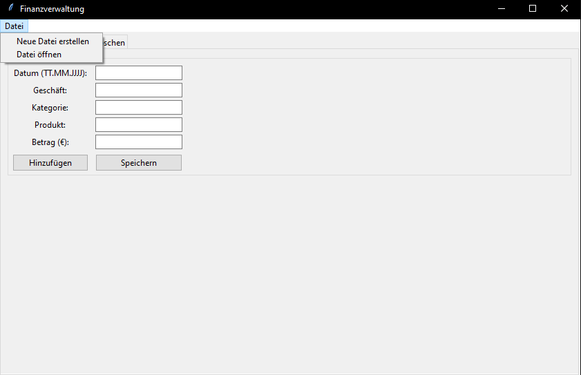
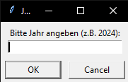
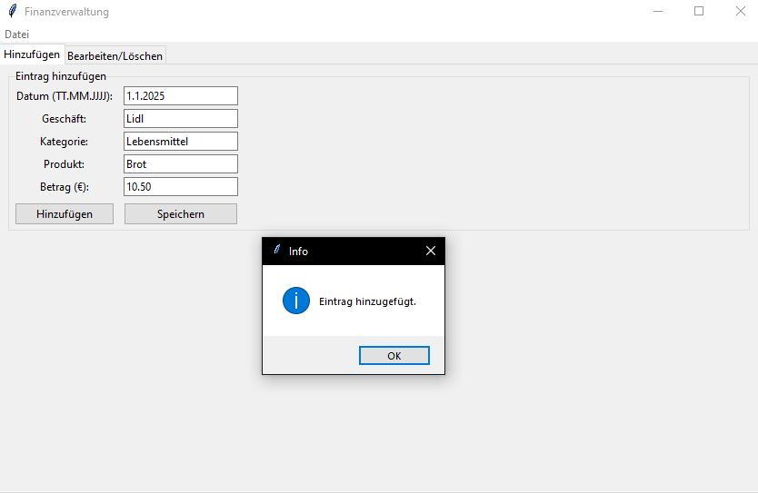
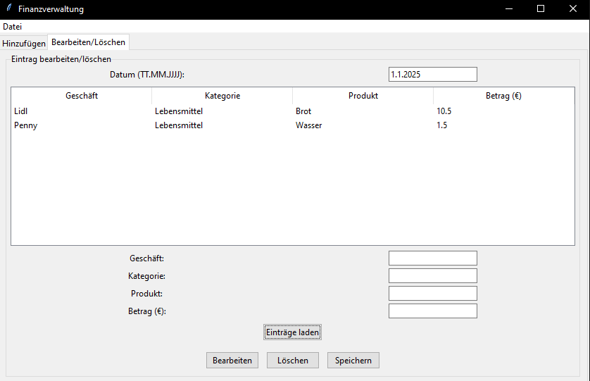
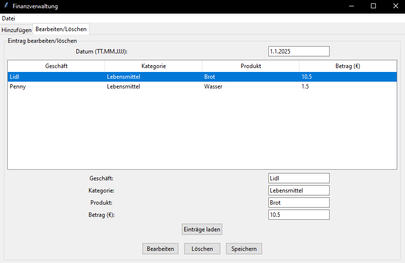
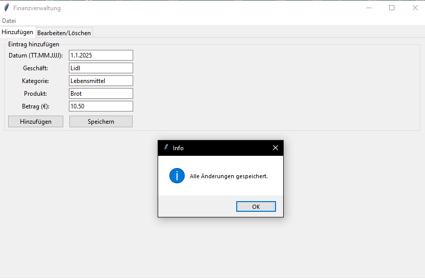
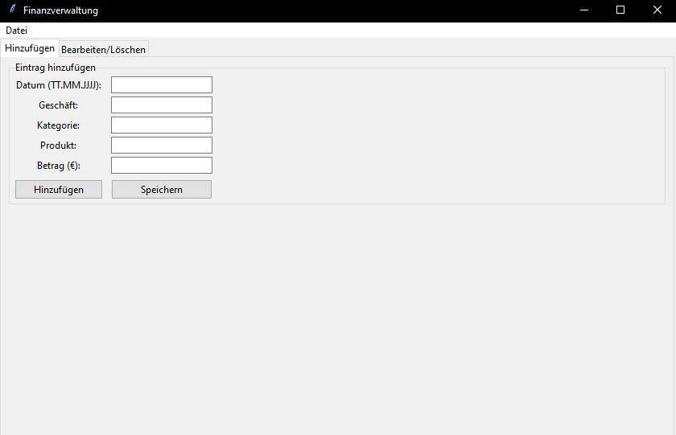
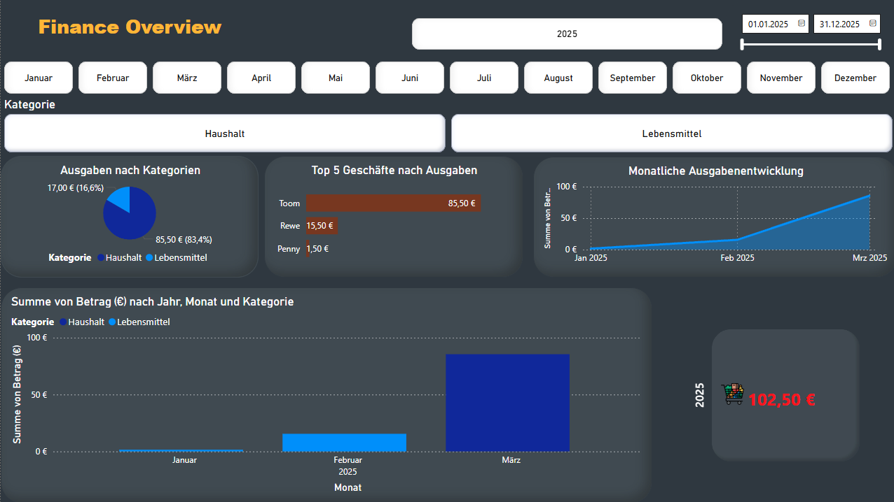

# FinanceOverview App

FinanceOverview ist eine Desktop-Anwendung zur Verwaltung deiner Finanzen. Mit dieser App kannst du Einträge für Einnahmen und Ausgaben erstellen, bearbeiten und speichern.

## Screenshots

### Neue Datei erstellen
  
Ansicht, um eine neue Finanzdatei zu erstellen.

  
Weitere Details beim Erstellen einer neuen Datei.

### Neuer Eintrag
  
Maske zum Hinzufügen eines neuen Eintrags, inklusive Datum, Geschäft, Kategorie, Produkt und Betrag.

### Eintrag bearbeiten
  
Lade bestehende Einträge in die Bearbeitungsansicht.

  
Bearbeite einen ausgewählten Eintrag.

  
Speichere Änderungen an einem Eintrag.

### Hauptansicht
  
Hauptübersicht der App, zeigt Monatsübersicht und Menüoptionen.

## Nutzung

1. Starte die App.
2. Erstelle eine neue Datei oder öffne eine bestehende Finanzdatei.
3. Füge neue Einträge hinzu oder bearbeite bestehende.
4. Speichere die Änderungen, um sie dauerhaft zu sichern.

### Finanzübersicht in Power BI
  
Power BI Dashboard zeigt:
- **Ausgaben nach Kategorien**: Kreisdiagramm für Haushalts- und Lebensmittelkosten.  
- **Top 5 Geschäfte nach Ausgaben**: Balkendiagramm zeigt, wo das meiste Geld ausgegeben wurde.  
- **Monatliche Ausgabenentwicklung**: Liniendiagramm visualisiert die Ausgaben über die Monate.  
- **Summen nach Jahr, Monat und Kategorie**: Balkendiagramm zur schnellen Übersicht.  
- **Gesamtausgaben 2025**: Anzeigenfeld für die Gesamtsumme aller Ausgaben.

## Nutzung

1. Starte die App.
2. Erstelle eine neue Datei oder öffne eine bestehende Finanzdatei.
3. Füge neue Einträge hinzu oder bearbeite bestehende.
4. Speichere die Änderungen, um sie dauerhaft zu sichern.
5. Optional: Exportiere die Daten und analysiere sie in Power BI, um Ausgaben visuell auszuwerten.
